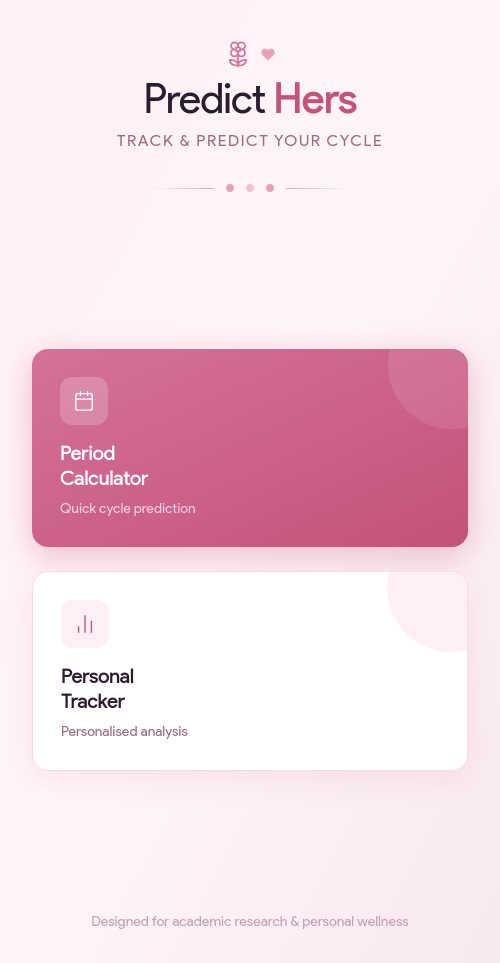
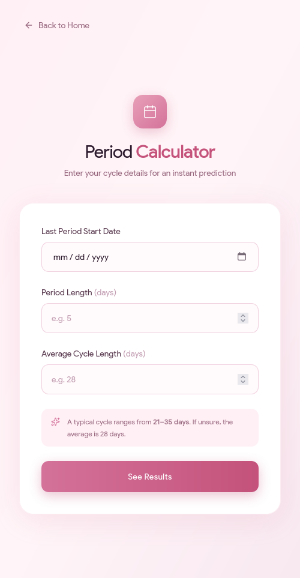
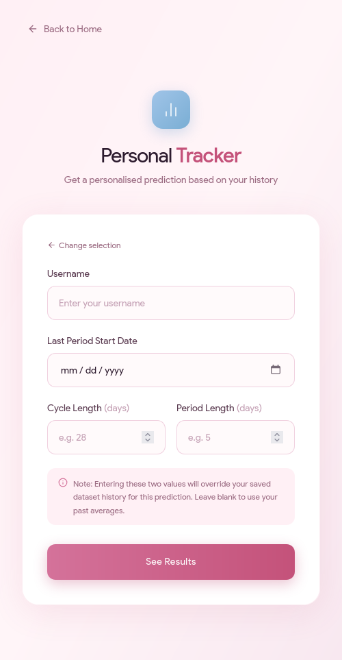
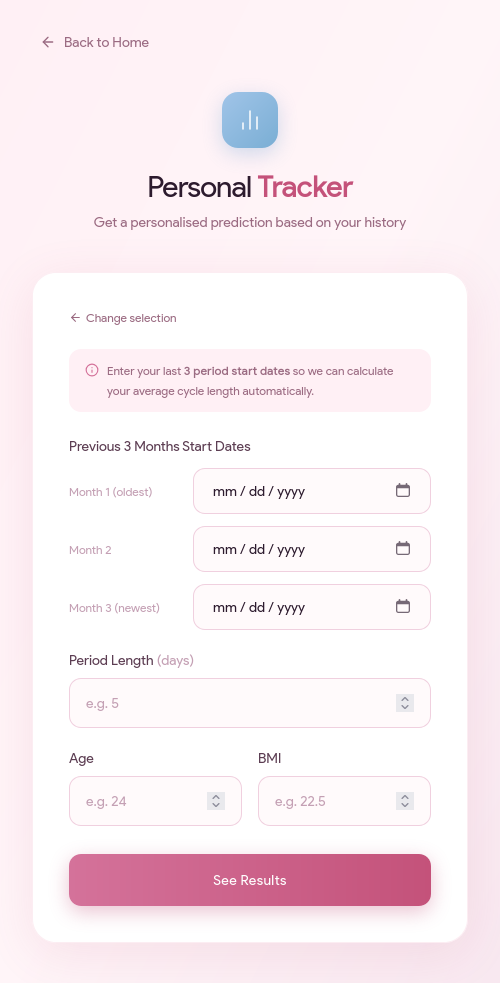
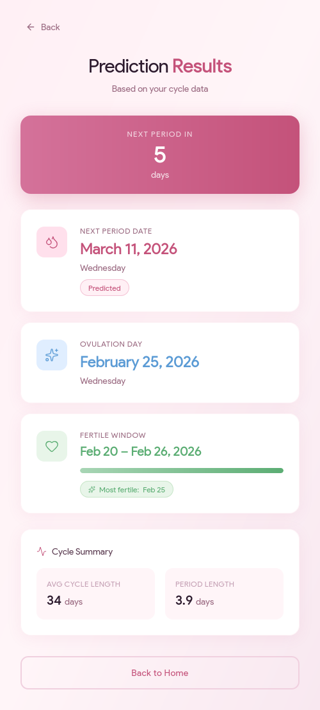

## 🌸 Personal Cycle Tracker

An intelligent, ML-powered web application that helps users track their menstrual cycles and predicts future dates based on their personal biological history.

Built with **Flask**, **scikit-learn (Random Forest Regressor)**, and a modern **Tailwind CSS** frontend.

---

## 📸 Application Screenshots

### UI
<div style="overflow-x:auto; white-space:nowrap;">
  
  
  
  
  
</div>

---

## ✨ Features

### 🤖 Machine Learning Predictions
Uses a **Random Forest Regressor** trained on menstrual cycle patterns to predict future cycles more accurately than a simple historical average.

### 🔄 Dual Input Methods

1. **Existing Users**
    - Predict using stored historical data

2. **New Users**
    - Enter last **3 months of cycle data**
    - Instant prediction with no stored history required

### 🎛 Smart Overrides
Users can optionally override:
- cycle length
- period length

to run **temporary "what-if" predictions**.

### 🐳 Fully Containerized
Runs anywhere using **Docker + Docker Compose**.

---

## 🛠️ Prerequisites

Install the following before running:

* [Git](https://git-scm.com/downloads)
* [Docker](https://docs.docker.com/get-docker/)
* [Docker Compose](https://docs.docker.com/compose/install/)

---

## 🚀 Installation & Setup

### 1. Clone the repository

```bash
git clone https://github.com/HeinHtetSoe-RAI7/PredictHers
cd PredictHers
```
### 2. Build and run Docker containers
```bash
docker compose up --build
```

### 3. Open the application
Open your browser and go to:
```bash
http://localhost:5000
```

### 4. Stop the application

Press:
```bash
CTRL + C
```

or run

```basg
docker compose down
```

## 📂 Project Structure
```
.
├── app.py
├── docker-compose.yml
├── Dockerfile
├── requirements.txt
├── README.md
│
├── dataset/
│   └── menstrual_data.csv
│
├── docs/
│   ├── screenshot1.png
│   ├── screenshot2.png
│   ├── screenshot3.png
│   ├── screenshot4.png
│   └── screenshot5.png
│
├── models/
│   └── universal_menstrual_model.pkl
│
├── static/
│   └── style.css
│
├── templates/
│   ├── calculator.html
│   ├── index.html
│   ├── result.html
│   └── tracker.html
│
├── train/
│   └── train.py
│
└── utilities/
    ├── __pycache__/
    ├── __init__.py
    ├── calculator.py
    ├── helper.py
    └── tracker.py
```

## 🧠 How it works?
The Personal Cycle Tracker works by analyzing your unique biological rhythm to predict your next period. When you provide your past cycle dates—either manually or by loading a saved profile—the app calculates your historical averages and cycle variations. Instead of just guessing your basic average, the built-in Machine Learning model looks for hidden patterns in your history, such as whether your cycles are gradually getting longer or shorter. It uses these subtle trends to predict the exact length of your upcoming cycle, and then adds that number to your last period's start date to give you a highly personalized prediction.